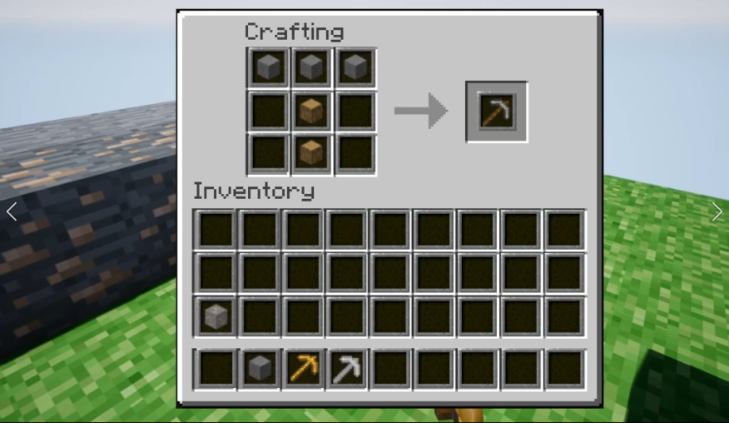

## MinecraftUE

- 마인크래프트 모작
- [데모 영상](https://youtu.be/7yRAWYkmaq8)

## 커밋 로그

### Commits on June 4, 2022

- 블럭을 캐낼때 `destroy` 하는게 아니라, 비활성화 시킴
- 나중에 우클릭해서 배치할 때 위치 변경 후, 활성화시키는 방식으로 할 예정

### Commits on Feb 21, 2022

- `TMap` 으로 도구 제작법 저장
- `CraftCreator` 액터 컴포넌트 생성
    - 현재 저장된 크래프트 배열에 맞는 `Wieldable` 아이템이 있으면 반환

### Commits on Feb 20, 2022

- Craft Menu 로 Wieldable 생산 가능 (테스트용 코드 제작)

### Commits on Feb 19, 2022

- 캐릭터가 Craft Inventory 가지고 있게끔
    - Craft Menu HUD BP function
        - `SetActiveCraftMenuItem` : Craft 인벤토리 창 시각화
        - `On Drop` : 아이템이 Craft Slot 파트로 드래그 되었는지 확인
        - `PutInNearestCraft` : 아이템을 인벤토리에서 Craft 인벤토리로 이동
- craft 탭에 드래그한 슬롯 아이템 추가 가능
- Craft Menu Craft 슬롯 추가 & CraftMenu 접었다 폈다 가능하도록

### Commits on Feb 18, 2022

- E 키로 Craft Menu 진입
- craft menu 인벤토리 기능 추가
- 블럭 타입 추가 & 블럭 깨면 블록 아이템 드롭
- 인벤토리 및 크래프트 메뉴(크래프트 인벤토리) 모두 블루프린트 단에서 제작

### Commits on Feb 17, 2022

- 블록 깬 후에 블록 아이템 드롭
- 블럭 타입 추가 및 블럭 깨진 후에 블럭 아이템 드롭
- 곡괭이 모든 타입 추가 

### Commits on Feb 16, 2022

- Throw 기능 및 현재 Wield Item 으로 material type & tool type 지정
- 마우스 휠로 인벤토리에서 무기 선택
- 인벤토리 및 픽업 기능
- 픽업 기능 추가 
- 블럭 깨기

### Commits on Feb 15, 2022

- detect block
- 블럭 깨지는 텍스처 추가
- add Block mesh